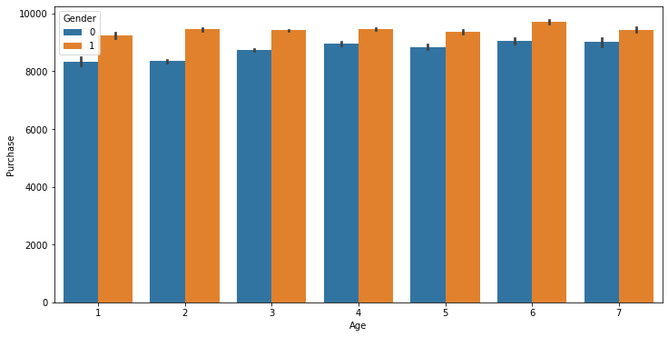
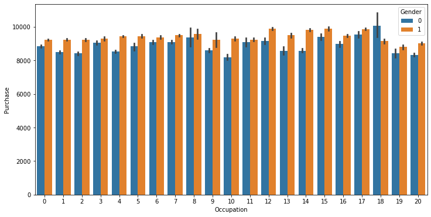
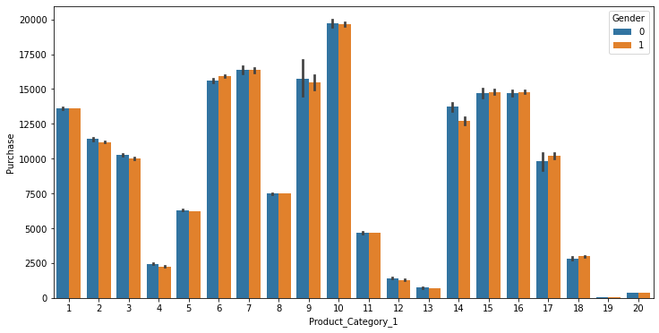

# Black Friday dataset eda and Feature engineering
cleaning and preparing the data for for training

# Problem Statement
A retail company “ABC Private Limited” wants to understand the customer purchase behaviour (specifically, purchase amount) against various products of different categories. They have shared purchase summary of various customers for selected high volume products from last month. The data set also contains customer demographics (age, gender, marital status, city_type, stay_in_current_city), product details (product_id and product category) and Total purchase_amount from last month.

Now, they want to build a model to predict the purchase amount of customer against various products which will help them to create personalized offer for customers against different products.


```python
import numpy as np
import seaborn as sns
import matplotlib as plt
import pandas as pd
%matplotlib inline
```


```python
#importing the data set
df_train = pd.read_csv('train.csv')
df_train.head()
```


<div>
<style scoped>
    .dataframe tbody tr th:only-of-type {
        vertical-align: middle;
    }

    .dataframe tbody tr th {
        vertical-align: top;
    }

    .dataframe thead th {
        text-align: right;
    }
</style>
<table border="1" class="dataframe">
  <thead>
    <tr style="text-align: right;">
      <th></th>
      <th>User_ID</th>
      <th>Product_ID</th>
      <th>Gender</th>
      <th>Age</th>
      <th>Occupation</th>
      <th>City_Category</th>
      <th>Stay_In_Current_City_Years</th>
      <th>Marital_Status</th>
      <th>Product_Category_1</th>
      <th>Product_Category_2</th>
      <th>Product_Category_3</th>
      <th>Purchase</th>
    </tr>
  </thead>
  <tbody>
    <tr>
      <th>0</th>
      <td>1000001</td>
      <td>P00069042</td>
      <td>F</td>
      <td>0-17</td>
      <td>10</td>
      <td>A</td>
      <td>2</td>
      <td>0</td>
      <td>3</td>
      <td>NaN</td>
      <td>NaN</td>
      <td>8370</td>
    </tr>
    <tr>
      <th>1</th>
      <td>1000001</td>
      <td>P00248942</td>
      <td>F</td>
      <td>0-17</td>
      <td>10</td>
      <td>A</td>
      <td>2</td>
      <td>0</td>
      <td>1</td>
      <td>6.0</td>
      <td>14.0</td>
      <td>15200</td>
    </tr>
    <tr>
      <th>2</th>
      <td>1000001</td>
      <td>P00087842</td>
      <td>F</td>
      <td>0-17</td>
      <td>10</td>
      <td>A</td>
      <td>2</td>
      <td>0</td>
      <td>12</td>
      <td>NaN</td>
      <td>NaN</td>
      <td>1422</td>
    </tr>
    <tr>
      <th>3</th>
      <td>1000001</td>
      <td>P00085442</td>
      <td>F</td>
      <td>0-17</td>
      <td>10</td>
      <td>A</td>
      <td>2</td>
      <td>0</td>
      <td>12</td>
      <td>14.0</td>
      <td>NaN</td>
      <td>1057</td>
    </tr>
    <tr>
      <th>4</th>
      <td>1000002</td>
      <td>P00285442</td>
      <td>M</td>
      <td>55+</td>
      <td>16</td>
      <td>C</td>
      <td>4+</td>
      <td>0</td>
      <td>8</td>
      <td>NaN</td>
      <td>NaN</td>
      <td>7969</td>
    </tr>
  </tbody>
</table>
</div>


```python
df_test=pd.read_csv('test.csv')
df_test.head()
```


<div>
<style scoped>
    .dataframe tbody tr th:only-of-type {
        vertical-align: middle;
    }

    .dataframe tbody tr th {
        vertical-align: top;
    }

    .dataframe thead th {
        text-align: right;
    }
</style>
<table border="1" class="dataframe">
  <thead>
    <tr style="text-align: right;">
      <th></th>
      <th>User_ID</th>
      <th>Product_ID</th>
      <th>Gender</th>
      <th>Age</th>
      <th>Occupation</th>
      <th>City_Category</th>
      <th>Stay_In_Current_City_Years</th>
      <th>Marital_Status</th>
      <th>Product_Category_1</th>
      <th>Product_Category_2</th>
      <th>Product_Category_3</th>
    </tr>
  </thead>
  <tbody>
    <tr>
      <th>0</th>
      <td>1000004</td>
      <td>P00128942</td>
      <td>M</td>
      <td>46-50</td>
      <td>7</td>
      <td>B</td>
      <td>2</td>
      <td>1</td>
      <td>1</td>
      <td>11.0</td>
      <td>NaN</td>
    </tr>
    <tr>
      <th>1</th>
      <td>1000009</td>
      <td>P00113442</td>
      <td>M</td>
      <td>26-35</td>
      <td>17</td>
      <td>C</td>
      <td>0</td>
      <td>0</td>
      <td>3</td>
      <td>5.0</td>
      <td>NaN</td>
    </tr>
    <tr>
      <th>2</th>
      <td>1000010</td>
      <td>P00288442</td>
      <td>F</td>
      <td>36-45</td>
      <td>1</td>
      <td>B</td>
      <td>4+</td>
      <td>1</td>
      <td>5</td>
      <td>14.0</td>
      <td>NaN</td>
    </tr>
    <tr>
      <th>3</th>
      <td>1000010</td>
      <td>P00145342</td>
      <td>F</td>
      <td>36-45</td>
      <td>1</td>
      <td>B</td>
      <td>4+</td>
      <td>1</td>
      <td>4</td>
      <td>9.0</td>
      <td>NaN</td>
    </tr>
    <tr>
      <th>4</th>
      <td>1000011</td>
      <td>P00053842</td>
      <td>F</td>
      <td>26-35</td>
      <td>1</td>
      <td>C</td>
      <td>1</td>
      <td>0</td>
      <td>4</td>
      <td>5.0</td>
      <td>12.0</td>
    </tr>
  </tbody>
</table>
</div>


```python
# first combine both the data set (merge both test and train data)
# pd.merge// pd.append
df = df_train.append(df_test)
df.head()
```


<div>
<style scoped>
    .dataframe tbody tr th:only-of-type {
        vertical-align: middle;
    }

    .dataframe tbody tr th {
        vertical-align: top;
    }

    .dataframe thead th {
        text-align: right;
    }
</style>
<table border="1" class="dataframe">
  <thead>
    <tr style="text-align: right;">
      <th></th>
      <th>User_ID</th>
      <th>Product_ID</th>
      <th>Gender</th>
      <th>Age</th>
      <th>Occupation</th>
      <th>City_Category</th>
      <th>Stay_In_Current_City_Years</th>
      <th>Marital_Status</th>
      <th>Product_Category_1</th>
      <th>Product_Category_2</th>
      <th>Product_Category_3</th>
      <th>Purchase</th>
    </tr>
  </thead>
  <tbody>
    <tr>
      <th>0</th>
      <td>1000001</td>
      <td>P00069042</td>
      <td>F</td>
      <td>0-17</td>
      <td>10</td>
      <td>A</td>
      <td>2</td>
      <td>0</td>
      <td>3</td>
      <td>NaN</td>
      <td>NaN</td>
      <td>8370.0</td>
    </tr>
    <tr>
      <th>1</th>
      <td>1000001</td>
      <td>P00248942</td>
      <td>F</td>
      <td>0-17</td>
      <td>10</td>
      <td>A</td>
      <td>2</td>
      <td>0</td>
      <td>1</td>
      <td>6.0</td>
      <td>14.0</td>
      <td>15200.0</td>
    </tr>
    <tr>
      <th>2</th>
      <td>1000001</td>
      <td>P00087842</td>
      <td>F</td>
      <td>0-17</td>
      <td>10</td>
      <td>A</td>
      <td>2</td>
      <td>0</td>
      <td>12</td>
      <td>NaN</td>
      <td>NaN</td>
      <td>1422.0</td>
    </tr>
    <tr>
      <th>3</th>
      <td>1000001</td>
      <td>P00085442</td>
      <td>F</td>
      <td>0-17</td>
      <td>10</td>
      <td>A</td>
      <td>2</td>
      <td>0</td>
      <td>12</td>
      <td>14.0</td>
      <td>NaN</td>
      <td>1057.0</td>
    </tr>
    <tr>
      <th>4</th>
      <td>1000002</td>
      <td>P00285442</td>
      <td>M</td>
      <td>55+</td>
      <td>16</td>
      <td>C</td>
      <td>4+</td>
      <td>0</td>
      <td>8</td>
      <td>NaN</td>
      <td>NaN</td>
      <td>7969.0</td>
    </tr>
  </tbody>
</table>
</div>


```python
#basic code
df.info()
```

    <class 'pandas.core.frame.DataFrame'>
    Int64Index: 783667 entries, 0 to 233598
    Data columns (total 12 columns):
     #   Column                      Non-Null Count   Dtype  
    ---  ------                      --------------   -----  
     0   User_ID                     783667 non-null  int64  
     1   Product_ID                  783667 non-null  object 
     2   Gender                      783667 non-null  object 
     3   Age                         783667 non-null  object 
     4   Occupation                  783667 non-null  int64  
     5   City_Category               783667 non-null  object 
     6   Stay_In_Current_City_Years  783667 non-null  object 
     7   Marital_Status              783667 non-null  int64  
     8   Product_Category_1          783667 non-null  int64  
     9   Product_Category_2          537685 non-null  float64
     10  Product_Category_3          237858 non-null  float64
     11  Purchase                    550068 non-null  float64
    dtypes: float64(3), int64(4), object(5)
    memory usage: 77.7+ MB
    


```python
df.describe()
```


<div>
<style scoped>
    .dataframe tbody tr th:only-of-type {
        vertical-align: middle;
    }

    .dataframe tbody tr th {
        vertical-align: top;
    }

    .dataframe thead th {
        text-align: right;
    }
</style>
<table border="1" class="dataframe">
  <thead>
    <tr style="text-align: right;">
      <th></th>
      <th>User_ID</th>
      <th>Occupation</th>
      <th>Marital_Status</th>
      <th>Product_Category_1</th>
      <th>Product_Category_2</th>
      <th>Product_Category_3</th>
      <th>Purchase</th>
    </tr>
  </thead>
  <tbody>
    <tr>
      <th>count</th>
      <td>7.836670e+05</td>
      <td>783667.000000</td>
      <td>783667.000000</td>
      <td>783667.000000</td>
      <td>537685.000000</td>
      <td>237858.000000</td>
      <td>550068.000000</td>
    </tr>
    <tr>
      <th>mean</th>
      <td>1.003029e+06</td>
      <td>8.079300</td>
      <td>0.409777</td>
      <td>5.366196</td>
      <td>9.844506</td>
      <td>12.668605</td>
      <td>9263.968713</td>
    </tr>
    <tr>
      <th>std</th>
      <td>1.727267e+03</td>
      <td>6.522206</td>
      <td>0.491793</td>
      <td>3.878160</td>
      <td>5.089093</td>
      <td>4.125510</td>
      <td>5023.065394</td>
    </tr>
    <tr>
      <th>min</th>
      <td>1.000001e+06</td>
      <td>0.000000</td>
      <td>0.000000</td>
      <td>1.000000</td>
      <td>2.000000</td>
      <td>3.000000</td>
      <td>12.000000</td>
    </tr>
    <tr>
      <th>25%</th>
      <td>1.001519e+06</td>
      <td>2.000000</td>
      <td>0.000000</td>
      <td>1.000000</td>
      <td>5.000000</td>
      <td>9.000000</td>
      <td>5823.000000</td>
    </tr>
    <tr>
      <th>50%</th>
      <td>1.003075e+06</td>
      <td>7.000000</td>
      <td>0.000000</td>
      <td>5.000000</td>
      <td>9.000000</td>
      <td>14.000000</td>
      <td>8047.000000</td>
    </tr>
    <tr>
      <th>75%</th>
      <td>1.004478e+06</td>
      <td>14.000000</td>
      <td>1.000000</td>
      <td>8.000000</td>
      <td>15.000000</td>
      <td>16.000000</td>
      <td>12054.000000</td>
    </tr>
    <tr>
      <th>max</th>
      <td>1.006040e+06</td>
      <td>20.000000</td>
      <td>1.000000</td>
      <td>20.000000</td>
      <td>18.000000</td>
      <td>18.000000</td>
      <td>23961.000000</td>
    </tr>
  </tbody>
</table>
</div>


```python
#lets delete some useless data so here there is no need for user id because it is a unique 
df.drop(['User_ID'],axis=1,inplace=True) #axis 1 delete it vertically and inplace means store and save new data
df.head()
```


<div>
<style scoped>
    .dataframe tbody tr th:only-of-type {
        vertical-align: middle;
    }

    .dataframe tbody tr th {
        vertical-align: top;
    }

    .dataframe thead th {
        text-align: right;
    }
</style>
<table border="1" class="dataframe">
  <thead>
    <tr style="text-align: right;">
      <th></th>
      <th>Product_ID</th>
      <th>Gender</th>
      <th>Age</th>
      <th>Occupation</th>
      <th>City_Category</th>
      <th>Stay_In_Current_City_Years</th>
      <th>Marital_Status</th>
      <th>Product_Category_1</th>
      <th>Product_Category_2</th>
      <th>Product_Category_3</th>
      <th>Purchase</th>
    </tr>
  </thead>
  <tbody>
    <tr>
      <th>0</th>
      <td>P00069042</td>
      <td>F</td>
      <td>0-17</td>
      <td>10</td>
      <td>A</td>
      <td>2</td>
      <td>0</td>
      <td>3</td>
      <td>NaN</td>
      <td>NaN</td>
      <td>8370.0</td>
    </tr>
    <tr>
      <th>1</th>
      <td>P00248942</td>
      <td>F</td>
      <td>0-17</td>
      <td>10</td>
      <td>A</td>
      <td>2</td>
      <td>0</td>
      <td>1</td>
      <td>6.0</td>
      <td>14.0</td>
      <td>15200.0</td>
    </tr>
    <tr>
      <th>2</th>
      <td>P00087842</td>
      <td>F</td>
      <td>0-17</td>
      <td>10</td>
      <td>A</td>
      <td>2</td>
      <td>0</td>
      <td>12</td>
      <td>NaN</td>
      <td>NaN</td>
      <td>1422.0</td>
    </tr>
    <tr>
      <th>3</th>
      <td>P00085442</td>
      <td>F</td>
      <td>0-17</td>
      <td>10</td>
      <td>A</td>
      <td>2</td>
      <td>0</td>
      <td>12</td>
      <td>14.0</td>
      <td>NaN</td>
      <td>1057.0</td>
    </tr>
    <tr>
      <th>4</th>
      <td>P00285442</td>
      <td>M</td>
      <td>55+</td>
      <td>16</td>
      <td>C</td>
      <td>4+</td>
      <td>0</td>
      <td>8</td>
      <td>NaN</td>
      <td>NaN</td>
      <td>7969.0</td>
    </tr>
  </tbody>
</table>
</div>


```python
#categorical features:- age , gendeer

```

we have to convert categorical feature into numerical feature 


```python
#lets convert gender directly from M,F to 1,0
df['Gender']=df['Gender'].map({'F':0,"M":1})
df.head()
#df['Gender']=pd.get_dummies(df['Gender'],drop_first=1)

```


<div>
<style scoped>
    .dataframe tbody tr th:only-of-type {
        vertical-align: middle;
    }

    .dataframe tbody tr th {
        vertical-align: top;
    }

    .dataframe thead th {
        text-align: right;
    }
</style>
<table border="1" class="dataframe">
  <thead>
    <tr style="text-align: right;">
      <th></th>
      <th>Product_ID</th>
      <th>Gender</th>
      <th>Age</th>
      <th>Occupation</th>
      <th>City_Category</th>
      <th>Stay_In_Current_City_Years</th>
      <th>Marital_Status</th>
      <th>Product_Category_1</th>
      <th>Product_Category_2</th>
      <th>Product_Category_3</th>
      <th>Purchase</th>
    </tr>
  </thead>
  <tbody>
    <tr>
      <th>0</th>
      <td>P00069042</td>
      <td>0</td>
      <td>0-17</td>
      <td>10</td>
      <td>A</td>
      <td>2</td>
      <td>0</td>
      <td>3</td>
      <td>NaN</td>
      <td>NaN</td>
      <td>8370.0</td>
    </tr>
    <tr>
      <th>1</th>
      <td>P00248942</td>
      <td>0</td>
      <td>0-17</td>
      <td>10</td>
      <td>A</td>
      <td>2</td>
      <td>0</td>
      <td>1</td>
      <td>6.0</td>
      <td>14.0</td>
      <td>15200.0</td>
    </tr>
    <tr>
      <th>2</th>
      <td>P00087842</td>
      <td>0</td>
      <td>0-17</td>
      <td>10</td>
      <td>A</td>
      <td>2</td>
      <td>0</td>
      <td>12</td>
      <td>NaN</td>
      <td>NaN</td>
      <td>1422.0</td>
    </tr>
    <tr>
      <th>3</th>
      <td>P00085442</td>
      <td>0</td>
      <td>0-17</td>
      <td>10</td>
      <td>A</td>
      <td>2</td>
      <td>0</td>
      <td>12</td>
      <td>14.0</td>
      <td>NaN</td>
      <td>1057.0</td>
    </tr>
    <tr>
      <th>4</th>
      <td>P00285442</td>
      <td>1</td>
      <td>55+</td>
      <td>16</td>
      <td>C</td>
      <td>4+</td>
      <td>0</td>
      <td>8</td>
      <td>NaN</td>
      <td>NaN</td>
      <td>7969.0</td>
    </tr>
  </tbody>
</table>
</div>


```python
#handelling categorical feature age
df['Age'].unique()
```


    array(['0-17', '55+', '26-35', '46-50', '51-55', '36-45', '18-25'],
          dtype=object)


```python
df['Age']=df['Age'].map({'0-17':1,'18-25':2,'26-35':3,'36-45':4,'46-50':5,'51-55':6,'55+':7})
```


```python
df['Age'].unique()
```


    array([1, 7, 3, 5, 6, 4, 2], dtype=int64)


we can also do label encoding for age


```python
#lets handle categorica; for city category
df_city = pd.get_dummies(df['City_Category'],drop_first=True)
```


```python
df_city.head()
```


<div>
<style scoped>
    .dataframe tbody tr th:only-of-type {
        vertical-align: middle;
    }

    .dataframe tbody tr th {
        vertical-align: top;
    }

    .dataframe thead th {
        text-align: right;
    }
</style>
<table border="1" class="dataframe">
  <thead>
    <tr style="text-align: right;">
      <th></th>
      <th>B</th>
      <th>C</th>
    </tr>
  </thead>
  <tbody>
    <tr>
      <th>0</th>
      <td>0</td>
      <td>0</td>
    </tr>
    <tr>
      <th>1</th>
      <td>0</td>
      <td>0</td>
    </tr>
    <tr>
      <th>2</th>
      <td>0</td>
      <td>0</td>
    </tr>
    <tr>
      <th>3</th>
      <td>0</td>
      <td>0</td>
    </tr>
    <tr>
      <th>4</th>
      <td>0</td>
      <td>1</td>
    </tr>
  </tbody>
</table>
</div>


```python
df = pd.concat([df,df_city],axis=1)
df.head()
```


<div>
<style scoped>
    .dataframe tbody tr th:only-of-type {
        vertical-align: middle;
    }

    .dataframe tbody tr th {
        vertical-align: top;
    }

    .dataframe thead th {
        text-align: right;
    }
</style>
<table border="1" class="dataframe">
  <thead>
    <tr style="text-align: right;">
      <th></th>
      <th>Product_ID</th>
      <th>Gender</th>
      <th>Age</th>
      <th>Occupation</th>
      <th>City_Category</th>
      <th>Stay_In_Current_City_Years</th>
      <th>Marital_Status</th>
      <th>Product_Category_1</th>
      <th>Product_Category_2</th>
      <th>Product_Category_3</th>
      <th>Purchase</th>
      <th>B</th>
      <th>C</th>
    </tr>
  </thead>
  <tbody>
    <tr>
      <th>0</th>
      <td>P00069042</td>
      <td>0</td>
      <td>1</td>
      <td>10</td>
      <td>A</td>
      <td>2</td>
      <td>0</td>
      <td>3</td>
      <td>NaN</td>
      <td>NaN</td>
      <td>8370.0</td>
      <td>0</td>
      <td>0</td>
    </tr>
    <tr>
      <th>1</th>
      <td>P00248942</td>
      <td>0</td>
      <td>1</td>
      <td>10</td>
      <td>A</td>
      <td>2</td>
      <td>0</td>
      <td>1</td>
      <td>6.0</td>
      <td>14.0</td>
      <td>15200.0</td>
      <td>0</td>
      <td>0</td>
    </tr>
    <tr>
      <th>2</th>
      <td>P00087842</td>
      <td>0</td>
      <td>1</td>
      <td>10</td>
      <td>A</td>
      <td>2</td>
      <td>0</td>
      <td>12</td>
      <td>NaN</td>
      <td>NaN</td>
      <td>1422.0</td>
      <td>0</td>
      <td>0</td>
    </tr>
    <tr>
      <th>3</th>
      <td>P00085442</td>
      <td>0</td>
      <td>1</td>
      <td>10</td>
      <td>A</td>
      <td>2</td>
      <td>0</td>
      <td>12</td>
      <td>14.0</td>
      <td>NaN</td>
      <td>1057.0</td>
      <td>0</td>
      <td>0</td>
    </tr>
    <tr>
      <th>4</th>
      <td>P00285442</td>
      <td>1</td>
      <td>7</td>
      <td>16</td>
      <td>C</td>
      <td>4+</td>
      <td>0</td>
      <td>8</td>
      <td>NaN</td>
      <td>NaN</td>
      <td>7969.0</td>
      <td>0</td>
      <td>1</td>
    </tr>
  </tbody>
</table>
</div>


```python
#now lets remove city category
df.drop(['City_Category'], axis=1,inplace = True)
```


```python
df.head()
```


<div>
<style scoped>
    .dataframe tbody tr th:only-of-type {
        vertical-align: middle;
    }

    .dataframe tbody tr th {
        vertical-align: top;
    }

    .dataframe thead th {
        text-align: right;
    }
</style>
<table border="1" class="dataframe">
  <thead>
    <tr style="text-align: right;">
      <th></th>
      <th>Product_ID</th>
      <th>Gender</th>
      <th>Age</th>
      <th>Occupation</th>
      <th>Stay_In_Current_City_Years</th>
      <th>Marital_Status</th>
      <th>Product_Category_1</th>
      <th>Product_Category_2</th>
      <th>Product_Category_3</th>
      <th>Purchase</th>
      <th>B</th>
      <th>C</th>
    </tr>
  </thead>
  <tbody>
    <tr>
      <th>0</th>
      <td>P00069042</td>
      <td>0</td>
      <td>1</td>
      <td>10</td>
      <td>2</td>
      <td>0</td>
      <td>3</td>
      <td>NaN</td>
      <td>NaN</td>
      <td>8370.0</td>
      <td>0</td>
      <td>0</td>
    </tr>
    <tr>
      <th>1</th>
      <td>P00248942</td>
      <td>0</td>
      <td>1</td>
      <td>10</td>
      <td>2</td>
      <td>0</td>
      <td>1</td>
      <td>6.0</td>
      <td>14.0</td>
      <td>15200.0</td>
      <td>0</td>
      <td>0</td>
    </tr>
    <tr>
      <th>2</th>
      <td>P00087842</td>
      <td>0</td>
      <td>1</td>
      <td>10</td>
      <td>2</td>
      <td>0</td>
      <td>12</td>
      <td>NaN</td>
      <td>NaN</td>
      <td>1422.0</td>
      <td>0</td>
      <td>0</td>
    </tr>
    <tr>
      <th>3</th>
      <td>P00085442</td>
      <td>0</td>
      <td>1</td>
      <td>10</td>
      <td>2</td>
      <td>0</td>
      <td>12</td>
      <td>14.0</td>
      <td>NaN</td>
      <td>1057.0</td>
      <td>0</td>
      <td>0</td>
    </tr>
    <tr>
      <th>4</th>
      <td>P00285442</td>
      <td>1</td>
      <td>7</td>
      <td>16</td>
      <td>4+</td>
      <td>0</td>
      <td>8</td>
      <td>NaN</td>
      <td>NaN</td>
      <td>7969.0</td>
      <td>0</td>
      <td>1</td>
    </tr>
  </tbody>
</table>
</div>


```python
#missing values
df.isnull().sum()
```


    Product_ID                         0
    Gender                             0
    Age                                0
    Occupation                         0
    Stay_In_Current_City_Years         0
    Marital_Status                     0
    Product_Category_1                 0
    Product_Category_2            245982
    Product_Category_3            545809
    Purchase                      233599
    B                                  0
    C                                  0
    dtype: int64


```python
#focus on replacing missing values
df['Product_Category_2'].unique()
```


    array([nan,  6., 14.,  2.,  8., 15., 16., 11.,  5.,  3.,  4., 12.,  9.,
           10., 17., 13.,  7., 18.])


```python
#so as you can see it is distinct value so we will taek mode to replace nan value
df['Product_Category_2'].value_counts()
```


    8.0     91317
    14.0    78834
    2.0     70498
    16.0    61687
    15.0    54114
    5.0     37165
    4.0     36705
    6.0     23575
    11.0    20230
    17.0    19104
    13.0    15054
    9.0      8177
    12.0     7801
    10.0     4420
    3.0      4123
    18.0     4027
    7.0       854
    Name: Product_Category_2, dtype: int64


```python
df['Product_Category_2'].mode()
```


    0    8.0
    dtype: float64


```python
## replace a missiing  calue with mode
df['Product_Category_2']=df['Product_Category_2'].fillna(df['Product_Category_2'].mode)
```


```python
df['Product_Category_2'].isnull().sum()
```


    0


```python
#product category 3 replace missing value
df['Product_Category_3'].value_counts()
df['Product_Category_3'].unique()
```


    array([nan, 14., 17.,  5.,  4., 16., 15.,  8.,  9., 13.,  6., 12.,  3.,
           18., 11., 10.])


```python
#its is also a discrete so we will find a mode
df['Product_Category_3'].mode()
```


    0    16.0
    dtype: float64


```python
#lets replace it form the mode
df['Product_Category_3']=df['Product_Category_3'].fillna(df['Product_Category_3'].mode)
```


```python
df['Product_Category_3'].isnull().sum()
```


    0


```python
df.columns
```


    Index(['Product_ID', 'Gender', 'Age', 'Occupation',
           'Stay_In_Current_City_Years', 'Marital_Status', 'Product_Category_1',
           'Product_Category_2', 'Product_Category_3', 'Purchase', 'B', 'C'],
          dtype='object')


```python
#convert this 4+ in to for stay in current city
df['Stay_In_Current_City_Years'].unique()
```


    array(['2', '4+', '3', '1', '0'], dtype=object)


```python
df['Stay_In_Current_City_Years']=df['Stay_In_Current_City_Years'].str.replace('+','')
```

    C:\Users\MANAV\AppData\Local\Temp/ipykernel_27540/2063355665.py:1: FutureWarning: The default value of regex will change from True to False in a future version. In addition, single character regular expressions will *not* be treated as literal strings when regex=True.
      df['Stay_In_Current_City_Years']=df['Stay_In_Current_City_Years'].str.replace('+','')
    


```python
df.head()
```


<div>
<style scoped>
    .dataframe tbody tr th:only-of-type {
        vertical-align: middle;
    }

    .dataframe tbody tr th {
        vertical-align: top;
    }

    .dataframe thead th {
        text-align: right;
    }
</style>
<table border="1" class="dataframe">
  <thead>
    <tr style="text-align: right;">
      <th></th>
      <th>Product_ID</th>
      <th>Gender</th>
      <th>Age</th>
      <th>Occupation</th>
      <th>Stay_In_Current_City_Years</th>
      <th>Marital_Status</th>
      <th>Product_Category_1</th>
      <th>Product_Category_2</th>
      <th>Product_Category_3</th>
      <th>Purchase</th>
      <th>B</th>
      <th>C</th>
    </tr>
  </thead>
  <tbody>
    <tr>
      <th>0</th>
      <td>P00069042</td>
      <td>0</td>
      <td>1</td>
      <td>10</td>
      <td>2</td>
      <td>0</td>
      <td>3</td>
      <td>&lt;bound method Series.mode of 0          NaN\n1...</td>
      <td>&lt;bound method Series.mode of 0          NaN\n1...</td>
      <td>8370.0</td>
      <td>0</td>
      <td>0</td>
    </tr>
    <tr>
      <th>1</th>
      <td>P00248942</td>
      <td>0</td>
      <td>1</td>
      <td>10</td>
      <td>2</td>
      <td>0</td>
      <td>1</td>
      <td>6.0</td>
      <td>14.0</td>
      <td>15200.0</td>
      <td>0</td>
      <td>0</td>
    </tr>
    <tr>
      <th>2</th>
      <td>P00087842</td>
      <td>0</td>
      <td>1</td>
      <td>10</td>
      <td>2</td>
      <td>0</td>
      <td>12</td>
      <td>&lt;bound method Series.mode of 0          NaN\n1...</td>
      <td>&lt;bound method Series.mode of 0          NaN\n1...</td>
      <td>1422.0</td>
      <td>0</td>
      <td>0</td>
    </tr>
    <tr>
      <th>3</th>
      <td>P00085442</td>
      <td>0</td>
      <td>1</td>
      <td>10</td>
      <td>2</td>
      <td>0</td>
      <td>12</td>
      <td>14.0</td>
      <td>&lt;bound method Series.mode of 0          NaN\n1...</td>
      <td>1057.0</td>
      <td>0</td>
      <td>0</td>
    </tr>
    <tr>
      <th>4</th>
      <td>P00285442</td>
      <td>1</td>
      <td>7</td>
      <td>16</td>
      <td>4</td>
      <td>0</td>
      <td>8</td>
      <td>&lt;bound method Series.mode of 0          NaN\n1...</td>
      <td>&lt;bound method Series.mode of 0          NaN\n1...</td>
      <td>7969.0</td>
      <td>0</td>
      <td>1</td>
    </tr>
  </tbody>
</table>
</div>


```python
df.info()
```

    <class 'pandas.core.frame.DataFrame'>
    Int64Index: 783667 entries, 0 to 233598
    Data columns (total 12 columns):
     #   Column                      Non-Null Count   Dtype  
    ---  ------                      --------------   -----  
     0   Product_ID                  783667 non-null  object 
     1   Gender                      783667 non-null  int64  
     2   Age                         783667 non-null  int64  
     3   Occupation                  783667 non-null  int64  
     4   Stay_In_Current_City_Years  783667 non-null  object 
     5   Marital_Status              783667 non-null  int64  
     6   Product_Category_1          783667 non-null  int64  
     7   Product_Category_2          783667 non-null  object 
     8   Product_Category_3          783667 non-null  object 
     9   Purchase                    550068 non-null  float64
     10  B                           783667 non-null  uint8  
     11  C                           783667 non-null  uint8  
    dtypes: float64(1), int64(5), object(4), uint8(2)
    memory usage: 67.3+ MB
    


```python
#'Stay_In_Current_City_Years' is a object type so lets convert it into  interger
df['Stay_In_Current_City_Years']=df['Stay_In_Current_City_Years'].astype(int)
df.info()

```

    <class 'pandas.core.frame.DataFrame'>
    Int64Index: 783667 entries, 0 to 233598
    Data columns (total 12 columns):
     #   Column                      Non-Null Count   Dtype  
    ---  ------                      --------------   -----  
     0   Product_ID                  783667 non-null  object 
     1   Gender                      783667 non-null  int64  
     2   Age                         783667 non-null  int64  
     3   Occupation                  783667 non-null  int64  
     4   Stay_In_Current_City_Years  783667 non-null  int32  
     5   Marital_Status              783667 non-null  int64  
     6   Product_Category_1          783667 non-null  int64  
     7   Product_Category_2          783667 non-null  object 
     8   Product_Category_3          783667 non-null  object 
     9   Purchase                    550068 non-null  float64
     10  B                           783667 non-null  uint8  
     11  C                           783667 non-null  uint8  
    dtypes: float64(1), int32(1), int64(5), object(3), uint8(2)
    memory usage: 64.3+ MB
    


```python
df['B']=df['B'].astype(int)
df['C']=df['C'].astype(int)
```


```python
df.info()
```

    <class 'pandas.core.frame.DataFrame'>
    Int64Index: 783667 entries, 0 to 233598
    Data columns (total 12 columns):
     #   Column                      Non-Null Count   Dtype  
    ---  ------                      --------------   -----  
     0   Product_ID                  783667 non-null  object 
     1   Gender                      783667 non-null  int64  
     2   Age                         783667 non-null  int64  
     3   Occupation                  783667 non-null  int64  
     4   Stay_In_Current_City_Years  783667 non-null  int32  
     5   Marital_Status              783667 non-null  int64  
     6   Product_Category_1          783667 non-null  int64  
     7   Product_Category_2          783667 non-null  object 
     8   Product_Category_3          783667 non-null  object 
     9   Purchase                    550068 non-null  float64
     10  B                           783667 non-null  int32  
     11  C                           783667 non-null  int32  
    dtypes: float64(1), int32(3), int64(5), object(3)
    memory usage: 68.8+ MB
    


```python
#visualisation
```


```python
import matplotlib
matplotlib.rcParams['figure.figsize'] = (12,6) 
sns.barplot('Age','Purchase',hue='Gender',data = df)
```

    C:\Users\MANAV\anaconda3\lib\site-packages\seaborn\_decorators.py:36: FutureWarning: Pass the following variables as keyword args: x, y. From version 0.12, the only valid positional argument will be `data`, and passing other arguments without an explicit keyword will result in an error or misinterpretation.
      warnings.warn(
    


    <AxesSubplot:xlabel='Age', ylabel='Purchase'>


    

    


# purchasing of men is high then women


```python
 sns.barplot('Occupation','Purchase',hue='Gender',data = df)
```

    C:\Users\MANAV\anaconda3\lib\site-packages\seaborn\_decorators.py:36: FutureWarning: Pass the following variables as keyword args: x, y. From version 0.12, the only valid positional argument will be `data`, and passing other arguments without an explicit keyword will result in an error or misinterpretation.
      warnings.warn(
    


    <AxesSubplot:xlabel='Occupation', ylabel='Purchase'>


    

    


```python
sns.barplot('Product_Category_1','Purchase',hue= 'Gender',data = df)
```

    C:\Users\MANAV\anaconda3\lib\site-packages\seaborn\_decorators.py:36: FutureWarning: Pass the following variables as keyword args: x, y. From version 0.12, the only valid positional argument will be `data`, and passing other arguments without an explicit keyword will result in an error or misinterpretation.
      warnings.warn(
    


    <AxesSubplot:xlabel='Product_Category_1', ylabel='Purchase'>


    

    


```python
##Feature Scaling
df_test=df[df['Purchase'].isnull()]
df_test
```


<div>
<style scoped>
    .dataframe tbody tr th:only-of-type {
        vertical-align: middle;
    }

    .dataframe tbody tr th {
        vertical-align: top;
    }

    .dataframe thead th {
        text-align: right;
    }
</style>
<table border="1" class="dataframe">
  <thead>
    <tr style="text-align: right;">
      <th></th>
      <th>Product_ID</th>
      <th>Gender</th>
      <th>Age</th>
      <th>Occupation</th>
      <th>Stay_In_Current_City_Years</th>
      <th>Marital_Status</th>
      <th>Product_Category_1</th>
      <th>Product_Category_2</th>
      <th>Product_Category_3</th>
      <th>Purchase</th>
      <th>B</th>
      <th>C</th>
    </tr>
  </thead>
  <tbody>
    <tr>
      <th>0</th>
      <td>P00128942</td>
      <td>1</td>
      <td>5</td>
      <td>7</td>
      <td>2</td>
      <td>1</td>
      <td>1</td>
      <td>11.0</td>
      <td>&lt;bound method Series.mode of 0          NaN\n1...</td>
      <td>NaN</td>
      <td>1</td>
      <td>0</td>
    </tr>
    <tr>
      <th>1</th>
      <td>P00113442</td>
      <td>1</td>
      <td>3</td>
      <td>17</td>
      <td>0</td>
      <td>0</td>
      <td>3</td>
      <td>5.0</td>
      <td>&lt;bound method Series.mode of 0          NaN\n1...</td>
      <td>NaN</td>
      <td>0</td>
      <td>1</td>
    </tr>
    <tr>
      <th>2</th>
      <td>P00288442</td>
      <td>0</td>
      <td>4</td>
      <td>1</td>
      <td>4</td>
      <td>1</td>
      <td>5</td>
      <td>14.0</td>
      <td>&lt;bound method Series.mode of 0          NaN\n1...</td>
      <td>NaN</td>
      <td>1</td>
      <td>0</td>
    </tr>
    <tr>
      <th>3</th>
      <td>P00145342</td>
      <td>0</td>
      <td>4</td>
      <td>1</td>
      <td>4</td>
      <td>1</td>
      <td>4</td>
      <td>9.0</td>
      <td>&lt;bound method Series.mode of 0          NaN\n1...</td>
      <td>NaN</td>
      <td>1</td>
      <td>0</td>
    </tr>
    <tr>
      <th>4</th>
      <td>P00053842</td>
      <td>0</td>
      <td>3</td>
      <td>1</td>
      <td>1</td>
      <td>0</td>
      <td>4</td>
      <td>5.0</td>
      <td>12.0</td>
      <td>NaN</td>
      <td>0</td>
      <td>1</td>
    </tr>
    <tr>
      <th>...</th>
      <td>...</td>
      <td>...</td>
      <td>...</td>
      <td>...</td>
      <td>...</td>
      <td>...</td>
      <td>...</td>
      <td>...</td>
      <td>...</td>
      <td>...</td>
      <td>...</td>
      <td>...</td>
    </tr>
    <tr>
      <th>233594</th>
      <td>P00118942</td>
      <td>0</td>
      <td>3</td>
      <td>15</td>
      <td>4</td>
      <td>1</td>
      <td>8</td>
      <td>&lt;bound method Series.mode of 0          NaN\n1...</td>
      <td>&lt;bound method Series.mode of 0          NaN\n1...</td>
      <td>NaN</td>
      <td>1</td>
      <td>0</td>
    </tr>
    <tr>
      <th>233595</th>
      <td>P00254642</td>
      <td>0</td>
      <td>3</td>
      <td>15</td>
      <td>4</td>
      <td>1</td>
      <td>5</td>
      <td>8.0</td>
      <td>&lt;bound method Series.mode of 0          NaN\n1...</td>
      <td>NaN</td>
      <td>1</td>
      <td>0</td>
    </tr>
    <tr>
      <th>233596</th>
      <td>P00031842</td>
      <td>0</td>
      <td>3</td>
      <td>15</td>
      <td>4</td>
      <td>1</td>
      <td>1</td>
      <td>5.0</td>
      <td>12.0</td>
      <td>NaN</td>
      <td>1</td>
      <td>0</td>
    </tr>
    <tr>
      <th>233597</th>
      <td>P00124742</td>
      <td>0</td>
      <td>5</td>
      <td>1</td>
      <td>4</td>
      <td>0</td>
      <td>10</td>
      <td>16.0</td>
      <td>&lt;bound method Series.mode of 0          NaN\n1...</td>
      <td>NaN</td>
      <td>0</td>
      <td>1</td>
    </tr>
    <tr>
      <th>233598</th>
      <td>P00316642</td>
      <td>0</td>
      <td>5</td>
      <td>0</td>
      <td>4</td>
      <td>1</td>
      <td>4</td>
      <td>5.0</td>
      <td>&lt;bound method Series.mode of 0          NaN\n1...</td>
      <td>NaN</td>
      <td>1</td>
      <td>0</td>
    </tr>
  </tbody>
</table>
<p>233599 rows × 12 columns</p>
</div>


```python
df_train = df[~df['Purchase'].isnull()]
```


```python
df_train
```


<div>
<style scoped>
    .dataframe tbody tr th:only-of-type {
        vertical-align: middle;
    }

    .dataframe tbody tr th {
        vertical-align: top;
    }

    .dataframe thead th {
        text-align: right;
    }
</style>
<table border="1" class="dataframe">
  <thead>
    <tr style="text-align: right;">
      <th></th>
      <th>Product_ID</th>
      <th>Gender</th>
      <th>Age</th>
      <th>Occupation</th>
      <th>Stay_In_Current_City_Years</th>
      <th>Marital_Status</th>
      <th>Product_Category_1</th>
      <th>Product_Category_2</th>
      <th>Product_Category_3</th>
      <th>Purchase</th>
      <th>B</th>
      <th>C</th>
    </tr>
  </thead>
  <tbody>
    <tr>
      <th>0</th>
      <td>P00069042</td>
      <td>0</td>
      <td>1</td>
      <td>10</td>
      <td>2</td>
      <td>0</td>
      <td>3</td>
      <td>&lt;bound method Series.mode of 0          NaN\n1...</td>
      <td>&lt;bound method Series.mode of 0          NaN\n1...</td>
      <td>8370.0</td>
      <td>0</td>
      <td>0</td>
    </tr>
    <tr>
      <th>1</th>
      <td>P00248942</td>
      <td>0</td>
      <td>1</td>
      <td>10</td>
      <td>2</td>
      <td>0</td>
      <td>1</td>
      <td>6.0</td>
      <td>14.0</td>
      <td>15200.0</td>
      <td>0</td>
      <td>0</td>
    </tr>
    <tr>
      <th>2</th>
      <td>P00087842</td>
      <td>0</td>
      <td>1</td>
      <td>10</td>
      <td>2</td>
      <td>0</td>
      <td>12</td>
      <td>&lt;bound method Series.mode of 0          NaN\n1...</td>
      <td>&lt;bound method Series.mode of 0          NaN\n1...</td>
      <td>1422.0</td>
      <td>0</td>
      <td>0</td>
    </tr>
    <tr>
      <th>3</th>
      <td>P00085442</td>
      <td>0</td>
      <td>1</td>
      <td>10</td>
      <td>2</td>
      <td>0</td>
      <td>12</td>
      <td>14.0</td>
      <td>&lt;bound method Series.mode of 0          NaN\n1...</td>
      <td>1057.0</td>
      <td>0</td>
      <td>0</td>
    </tr>
    <tr>
      <th>4</th>
      <td>P00285442</td>
      <td>1</td>
      <td>7</td>
      <td>16</td>
      <td>4</td>
      <td>0</td>
      <td>8</td>
      <td>&lt;bound method Series.mode of 0          NaN\n1...</td>
      <td>&lt;bound method Series.mode of 0          NaN\n1...</td>
      <td>7969.0</td>
      <td>0</td>
      <td>1</td>
    </tr>
    <tr>
      <th>...</th>
      <td>...</td>
      <td>...</td>
      <td>...</td>
      <td>...</td>
      <td>...</td>
      <td>...</td>
      <td>...</td>
      <td>...</td>
      <td>...</td>
      <td>...</td>
      <td>...</td>
      <td>...</td>
    </tr>
    <tr>
      <th>550063</th>
      <td>P00372445</td>
      <td>1</td>
      <td>6</td>
      <td>13</td>
      <td>1</td>
      <td>1</td>
      <td>20</td>
      <td>&lt;bound method Series.mode of 0          NaN\n1...</td>
      <td>&lt;bound method Series.mode of 0          NaN\n1...</td>
      <td>368.0</td>
      <td>1</td>
      <td>0</td>
    </tr>
    <tr>
      <th>550064</th>
      <td>P00375436</td>
      <td>0</td>
      <td>3</td>
      <td>1</td>
      <td>3</td>
      <td>0</td>
      <td>20</td>
      <td>&lt;bound method Series.mode of 0          NaN\n1...</td>
      <td>&lt;bound method Series.mode of 0          NaN\n1...</td>
      <td>371.0</td>
      <td>0</td>
      <td>1</td>
    </tr>
    <tr>
      <th>550065</th>
      <td>P00375436</td>
      <td>0</td>
      <td>3</td>
      <td>15</td>
      <td>4</td>
      <td>1</td>
      <td>20</td>
      <td>&lt;bound method Series.mode of 0          NaN\n1...</td>
      <td>&lt;bound method Series.mode of 0          NaN\n1...</td>
      <td>137.0</td>
      <td>1</td>
      <td>0</td>
    </tr>
    <tr>
      <th>550066</th>
      <td>P00375436</td>
      <td>0</td>
      <td>7</td>
      <td>1</td>
      <td>2</td>
      <td>0</td>
      <td>20</td>
      <td>&lt;bound method Series.mode of 0          NaN\n1...</td>
      <td>&lt;bound method Series.mode of 0          NaN\n1...</td>
      <td>365.0</td>
      <td>0</td>
      <td>1</td>
    </tr>
    <tr>
      <th>550067</th>
      <td>P00371644</td>
      <td>0</td>
      <td>5</td>
      <td>0</td>
      <td>4</td>
      <td>1</td>
      <td>20</td>
      <td>&lt;bound method Series.mode of 0          NaN\n1...</td>
      <td>&lt;bound method Series.mode of 0          NaN\n1...</td>
      <td>490.0</td>
      <td>1</td>
      <td>0</td>
    </tr>
  </tbody>
</table>
<p>550068 rows × 12 columns</p>
</div>


```python
#feature scaling 
from sklearn.prep
```
